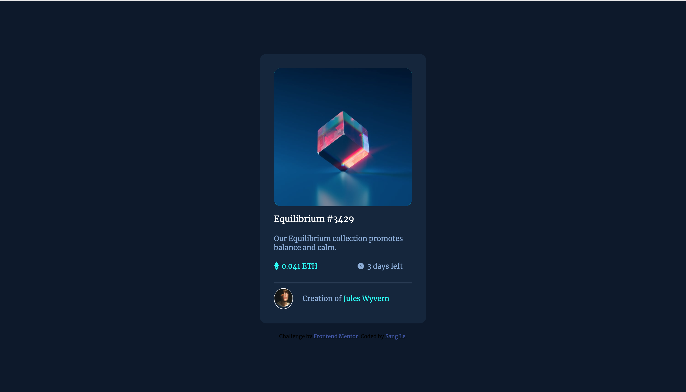

# Frontend Mentor - NFT preview card component solution

This is a solution to the [NFT preview card component challenge on Frontend Mentor](https://www.frontendmentor.io/challenges/nft-preview-card-component-SbdUL_w0U). Frontend Mentor challenges help you improve your coding skills by building realistic projects. 

## Overview

### The challenge

Users should be able to:

- View the optimal layout depending on their device's screen size
- See hover states for interactive elements

### Screenshot

### Links

- Solution URL: [Here](https://github.com/sqle157/nft.github.io)
- Live Site URL: [Here](https://sqle157.github.io/nft.github.io/)

### Built with

- Semantic HTML5 markup
- CSS custom properties
- Flexbox

## Author

- Website - [Sang Le](https://github.com/sqle157)
- Frontend Mentor - [@sqle157](https://www.frontendmentor.io/profile/sqle157)